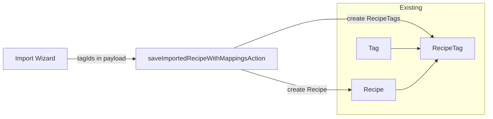

# Plan: Add recipe tag input to the recipe details form

## Goal

Ensure users can assign **tags** to a recipe when creating or editing it. Tags already exist in the database (Tag model, RecipeTag join). The **edit** flow already has a tag picker on [components/forms/recipe-form.tsx](components/forms/recipe-form.tsx). This plan adds the **tag input to the import wizard** so that when creating a recipe via URL import, image import, or manual entry, users can select existing tags or create new ones before saving.

## Scope

- **Recipe details form** = the form where recipe metadata is entered: title, source URL, image URL, servings, times, instructions, ingredients, notes. It appears in:
  1. **[components/forms/recipe-form.tsx](components/forms/recipe-form.tsx)** – used on the edit page (`/recipes/[id]/edit`). **Already has** [RecipeTagPicker](components/recipes/recipe-tag-picker.tsx) and submits `tagIds`; no change needed.
  2. **Import wizard "Recipe details" card** – [components/recipes/import/import-wizard.tsx](components/recipes/import/import-wizard.tsx): the manual form and the post-import review. **Does not** currently expose tags; add tag selection here and pass `tagIds` into the save action.

- **Ingredient details form** (ingredient-form.tsx) has a Category field for **ingredients**; this plan does not change that.

---

## Existing pieces (no changes)

- **Schema**: [prisma/schema.prisma](prisma/schema.prisma) – `Tag`, `RecipeTag`, `Recipe.recipeTags` already exist.
- **Recipe create/update/duplicate**: [app/actions/recipes.actions.ts](app/actions/recipes.actions.ts) – already reads `tagIds` from FormData and creates/updates RecipeTags with ownership checks.
- **Recipe form (edit)**: [components/forms/recipe-form.tsx](components/forms/recipe-form.tsx) – already uses `RecipeTagPicker`, `existingTags` / `initialTagIds`, and hidden `tagIds` inputs.
- **Edit page**: [app/(app)/recipes/[id]/edit/page.tsx](app/(app)/recipes/[id]/edit/page.tsx) – already passes `existingTags` and `initialTagIds` to RecipeForm.
- **List/detail**: Recipe list cards and [components/recipes/recipe-view.tsx](components/recipes/recipe-view.tsx) already show tags.

---

## Import wizard: add tag input

- **[components/recipes/import/import-wizard.tsx](components/recipes/import/import-wizard.tsx)**  
  - Add state for selected tag IDs: e.g. `selectedTagIds: string[]` (and optionally `existingTagsState` if we need to append newly created tags).
  - In the **"Recipe details"** card (the form that shows title, source URL, image URL, servings, times, instructions, ingredients, notes), add the existing **[RecipeTagPicker](components/recipes/recipe-tag-picker.tsx)** component:
    - Props: `existingTags`, `selectedTagIds`, `onChange`, `onCreateTag` (call `createTagAction`, then append new tag to list and selection).
  - **Where to get existingTags**: Pass `existingTags` as a prop from the parent page so the wizard can show the picker without an extra client fetch, or call `listTagsAction()` on mount and store in state.
  - When building the payload for save (e.g. in `handleSave` where you call `saveImportedRecipeWithMappingsAction`), include `tagIds: selectedTagIds` in the `recipe` object (or at top level if the schema expects it there).

- **[app/(app)/recipes/new/page.tsx](app/(app)/recipes/new/page.tsx)**  
  - Fetch the current user’s tags (e.g. `listTagsForUser(session.user.id)` from [lib/queries/tags.ts](lib/queries/tags.ts)) and pass them to `ImportWizard`, e.g. `existingTags={tags}`.

---

## Import schema and save action

- **[features/import/import.schemas.ts](features/import/import.schemas.ts)**  
  - In `saveImportedRecipeRecipeSchema`, add `tagIds: z.array(z.string().min(1)).optional().default([])` so the recipe payload can include tag IDs.

- **[app/actions/import.actions.ts](app/actions/import.actions.ts)**  
  - In `saveImportedRecipeWithMappingsAction`, after creating the recipe and its instructions/ingredients:
    - Read `tagIds` from `recipeData.tagIds` (or equivalent from parsed payload).
    - Verify each tag exists and `tag.userId === user.id` (same pattern as [app/actions/recipes.actions.ts](app/actions/recipes.actions.ts) in `createRecipeAction`).
    - Create `RecipeTag` records for the new recipe and the valid tag IDs.

---

## Flow summary

- **Edit recipe**: Already supported – RecipeForm has RecipeTagPicker and submits tagIds; server updates RecipeTags.
- **Create recipe via import**: User selects tags in the Recipe details card; wizard sends tagIds in the save payload; import action creates the recipe then creates RecipeTags for each valid tagId.

---

## Files to change

- [components/recipes/import/import-wizard.tsx](components/recipes/import/import-wizard.tsx): Add `selectedTagIds` state and `RecipeTagPicker` to the Recipe details card. Include `tagIds: selectedTagIds` in the object passed to `saveImportedRecipeWithMappingsAction`. Accept `existingTags` prop and wire `onCreateTag` to `createTagAction` and local state.
- [app/(app)/recipes/new/page.tsx](app/(app)/recipes/new/page.tsx): Fetch user tags (e.g. `listTagsForUser`) and pass `existingTags` to `ImportWizard`.
- [features/import/import.schemas.ts](features/import/import.schemas.ts): Add `tagIds` to `saveImportedRecipeRecipeSchema`.
- [app/actions/import.actions.ts](app/actions/import.actions.ts): After creating the recipe (and instructions/ingredients), create RecipeTags for `recipeData.tagIds` with ownership check.

---

## Files not changed

- No new files required: reuse [components/recipes/recipe-tag-picker.tsx](components/recipes/recipe-tag-picker.tsx) and [app/actions/tags.actions.ts](app/actions/tags.actions.ts).
- No Prisma or recipe action changes: tags and recipe tag handling already exist.

---

## Summary

| Area | Change |
|------|--------|
| Schema | None – tags and RecipeTag already exist. |
| Recipe form (edit) | None – already has tag picker. |
| Import wizard | Add RecipeTagPicker to Recipe details card; state for selectedTagIds; pass tagIds in save payload. |
| New recipe page | Pass existingTags into ImportWizard. |
| Import schema | Add tagIds to saveImportedRecipeRecipeSchema. |
| Import action | After creating recipe, create RecipeTags for validated tagIds. |
